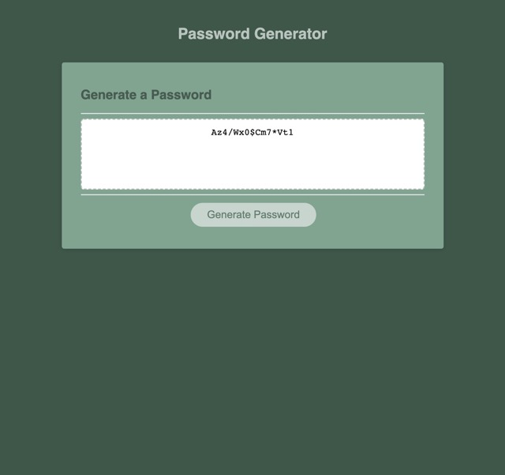

# Pasword-Generator

## Description
This project required using starter code to create an application that enables users to generate random passwords based on criteria they have selceted. When users click the "Generate Password" button, they will be presented with a series of prompts asking for the desired criteria. Users can set the password length and choose to include uppercase, lowercase, numeric, and special characters. Once the user has set their desired criteria, a password will be randomly generated and presented in the text box.

```
### Tasks Completed
* Declared function to generate password
* Set global and local variables holding criteria characters 
* Created internal function that displays prompts to gather criteria
* Used iteration on passwordLength
* Used conditional statements within loops to check criteria
* Used Math to generate random characters for selected criteria
* Retunerd password text to display generated password
* Edited colors on stylesheet
```




## Installation
Upload index.html and assets folder to the deployed webserver. The assets folder contains JS and CSS files.

The linked deployed website was deployed using GitHub pages.

## Usage
The application can be viewed with the below links:

* [Deployed website](https://dhoffman03.github.io/Password-Generator/)

* [Code repository](https://github.com/dhoffman03/Password-Generator.git)

## Credits
This project was completed through the University of Minesota Coding Bootcamp
 
## Refrences 
* [MDN Loops and Iteration](https://developer.mozilla.org/en-US/docs/Web/JavaScript/Guide/Loops_and_iteration)
* [MDN Arrays](https://developer.mozilla.org/en-US/docs/Web/JavaScript/Reference/Global_Objects/Array/length)
* [MDN Math](https://developer.mozilla.org/en-US/docs/Web/JavaScript/Reference/Global_Objects/Math)
